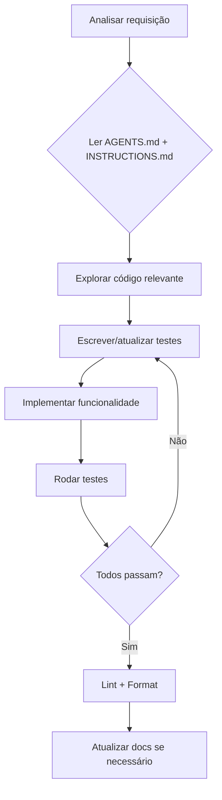

# INSTRUCTIONS.md — Diretrizes para LLMs

Este arquivo define como agentes de IA (LLMs) devem trabalhar neste projeto. Siga estas diretrizes rigorosamente ao modificar código, criar novos recursos ou depurar problemas.

---

## 1. Arquitetura & Padrões

### 1.1 Hexagonal (Ports & Adapters)
- **Core** (`backend/core/`) não pode importar nada de `adapters/` ou frameworks externos
- Portas (interfaces) em `ports.py`, entidades em `entities.py`, serviços em `services.py`
- Adapters implementam as portas; use in-memory adapters nos testes
- `GatewayService` recebe as portas por injeção de dependência no construtor

```python
# Correto
class GatewayService:
    def __init__(self, catalog: CatalogRepository, state: StateRepository, ...):
        ...

# Incorreto
class GatewayService:
    def __init__(self):
        self._catalog = SqliteCatalogRepo(...)  # dependência direta
```

### 1.2 Monorepo
- Backend Python em `backend/`, frontend Vue em `src/`, TUI em `mcp-tui.py`
- E2E tests em `e2e/`, docs em `docs/`
- Scripts npm em `package.json` para dev/test/lint/format

---

## 2. Segurança (OWASP)

### 2.1 API Keys & Secrets
- **NUNCA** hardcode secrets no código
- **NUNCA** commitar `.env` (reais); use `.env.example` com placeholders
- **NUNCA** expor tokens em logs, mensagens de erro, ou respostas HTTP
- Usar `os.environ.get()` para ler variáveis de ambiente

### 2.2 API REST
- Validar todos os inputs (tamanho, formato, encoding)
- Escapar nomes de servidores em URLs (`encodeURIComponent`)
- CORS configurado (atualmente aberto para dev — restringir em produção)
- Sem execução de comandos arbitrários via input do usuário

### 2.3 SQLite
- Usar `timeout=15` e `PRAGMA journal_mode=WAL` em todas as conexões
- Fechar conexões após uso (context manager ou try/finally)
- Sem concatenação de strings em queries

---

## 3. Qualidade & Testes

### 3.1 TDD/SDD
- Testes primeiro ou simultaneamente ao código
- Backend: Pytest em `backend/tests/`
- Frontend: Vitest em `src/__tests__/`
- E2E: Playwright em `e2e/`

### 3.2 Cobertura
- Testar fluxos: sucesso, erro, borda
- Backend: adapters in-memory para isolar core
- Frontend: mock da api, testar store + componentes

### 3.3 Fallow (Codebase Intelligence)
**Fallow** (`fallow`) é uma ferramenta de análise determinística de codebase para TypeScript/JavaScript. Ela executa análise estática em Rust (sem AI) para detectar dead code, duplicação, complexidade, hotspots, violações de arquitetura e higiene de dependências.

#### Uso
```bash
npm run fallow              # Análise completa
npm run fallow:audit        # PR risk gate
npm run fallow:health       # Health score + hotspots + targets
npm run fallow:dead-code    # Cleanup opportunities
npm run fallow:fix          # Dry-run autofix
```

#### Expectativas
- **Health score** alvo: ≥ 80 (atual: 92 A)
- **Dead code**: 0 issues (ignorar `@vue/test-utils`, `jiti`, `fallow`)
- **Duplicação**: 0% (atual)
- **Complexidade**: média 1.3 cyclomatic, maintainability 91.9
- **Único hotspot**: `src/api/index.ts` (41 LOC, 3 dependentes) — candidato a split

#### Integração CI
Fallow está configurado com baselines em `fallow-baselines/`. O audit usa esses baselines para reportar apenas issues novas. Use `npm run fallow:audit` antes de abrir PRs.

#### Regras para LLMs
1. Rodar `npm run fallow:audit` DEPOIS de modificar código TS/Vue
2. Corrigir issues de complexidade, dead code, duplicação introduzidas
3. Se adicionar dependência nova, verificar se Fallow a reporta como não utilizada
4. Atualizar baselines com `npx fallow dead-code --save-baseline <path>` quando aceitar mudanças permanentes

### 3.4 Snyk (Segurança)
**Snyk CLI** escaneia vulnerabilidades em dependências npm e Python, código IaC e código customizado.

```bash
npm run snyk:test       # Scan de dependências (npm + Python)
npm run snyk:monitor    # Monitoramento contínuo no Snyk.io
npm run snyk:iac        # Scan de IaC (Docker, docker-compose)
npm run snyk:code       # SAST (código customizado)
```

Estado atual: **0 vulnerabilidades** em 84 dependências npm.
Config: `.snyk` com exclusão de test/artifacts/coverage.

### 3.5 Rodar antes de commitar

```bash
cd backend && python3 -m pytest  # 27 testes
npm run test:unit                # 5 testes Vitest
npm run fallow:audit             # Fallow audit
npm run snyk:test                # Snyk security scan
npm run lint                     # Oxlint + ESLint
npm run format                   # Prettier
```

---

## 4. Subagentes & Paralelismo

### 4.1 Quando Usar Subagentes
Use `task` tool com subagentes quando:
- Tarefas independentes podem rodar em paralelo (ex.: criar múltiplos testes)
- Pesquisas profundas no código (explore subagent)
- Refatorações que afetam múltiplos arquivos

### 4.2 Estrutura
- Cada subagente recebe contexto suficiente (paths, padrões, exemplos)
- Subagentes NO TOCAM em arquivos que outro subagente está modificando
- Coordenar merge via git worktree ou branches se necessário

### 4.3 Git Worktree
Para mudanças paralelas grandes, use git worktree:

```bash
git worktree add ../gmcp-feature-branch feature-branch
# Trabalhar em ambos os diretórios simultaneamente
git worktree remove ../gmcp-feature-branch
```

---

## 5. Código & Estilo

### 5.1 Geral
- Código em **inglês** (variáveis, funções, classes, comentários)
- UI/user-facing strings em **pt-BR** e **en-US** via i18n
- Sem comentários no código a menos que essencial
- Nomes descritivos e consistentes

### 5.2 Python
- Tipos em todas as funções públicas
- stdlib: apenas bibliotecas padrão para TUI
- FastAPI: type hints, Pydantic para schemas (se adicionar)
- SQLite: `with conn:` context manager

### 5.3 TypeScript/Vue
- `script setup lang="ts"` em todos os componentes
- Tipos no `src/types/`, stores no `src/stores/`
- `useI18n()` para i18n, NUNCA strings fixas em UI
- Tailwind CSS v4 utility classes

### 5.4 TUI (curses)
- stdlib apenas — zero dependências externas
- Internacionalização via `backend/core/i18n.py`
- Suporte a mouse (xterm alternate scroll)

---

## 6. i18n

### 6.1 Adicionar Nova Chave
1. Adicionar nos 3 lugares:
   - `backend/core/i18n.py` (dicionários `pt-BR` e `en-US`)
   - `src/locales/pt-BR.json`
   - `src/locales/en-US.json`
2. Usar `t('chave')` na TUI, `t('chave')` na Web

### 6.2 Estrutura de Chaves
```
tab.{home,mcps,market}
home.{recent,no_logs,quick_actions,restart,...}
mcps.{search,filter_all,filter_active,filter_inactive,active,inactive,...}
market.{search,install_btn,details,close,status_installed,status_available,...}
stats.{installed,active,catalog}
dialog.{confirm,cancel}
```

---

## 7. Tratamento de Erros

### 7.1 Backend
- Exceções mapeadas para HTTP status codes apropriados
- `HTTPException` com mensagens descritivas (não expor stack)
- Log de erros no stderr (uvicorn gerencia)

### 7.2 Frontend
- `store.error` exibido no template como alerta
- Failed to fetch tratado com mensagem amigável
- ConfirmDialog antes de ações destrutivas

### 7.3 SQLite
- `database is locked` → `timeout=15` + `PRAGMA journal_mode=WAL`
- Se persistir, retry com backoff exponencial

---

## 8. Fluxo de Trabalho



1. **Ler AGENTS.md** — entender estado atual, features concluídas, pendências
2. **Ler INSTRUCTIONS.md** — aplicar padrões de arquitetura, segurança, testes
3. **Explorar** — buscar código relacionado antes de modificar
4. **Testar primeiro** — TDD/SDD
5. **Implementar** — seguindo hexagonal + i18n + segurança
6. **Verificar** — `python3 -m pytest && npm run test:unit && npm run lint`
7. **Documentar** — atualizar AGENTS.md e docs se necessário
