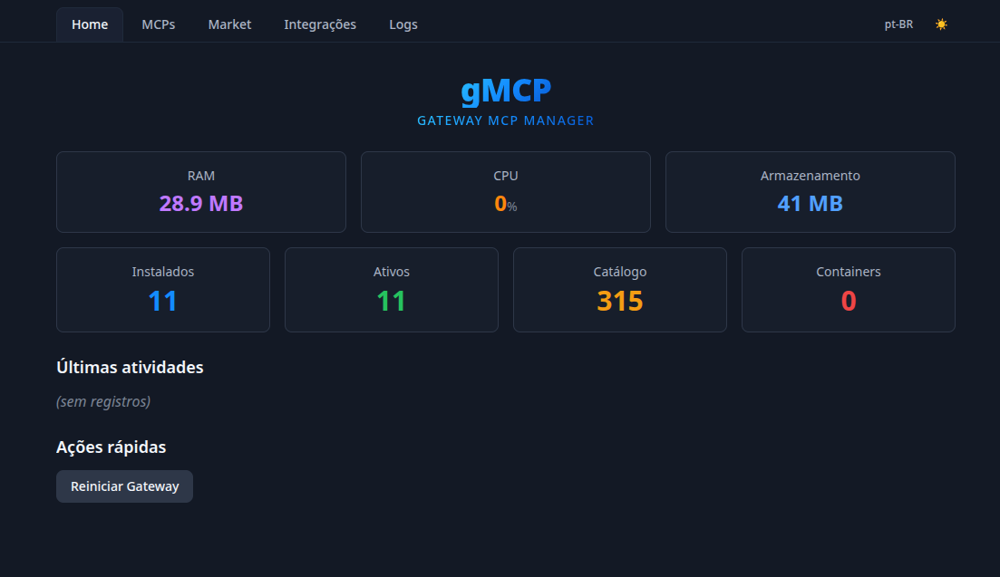
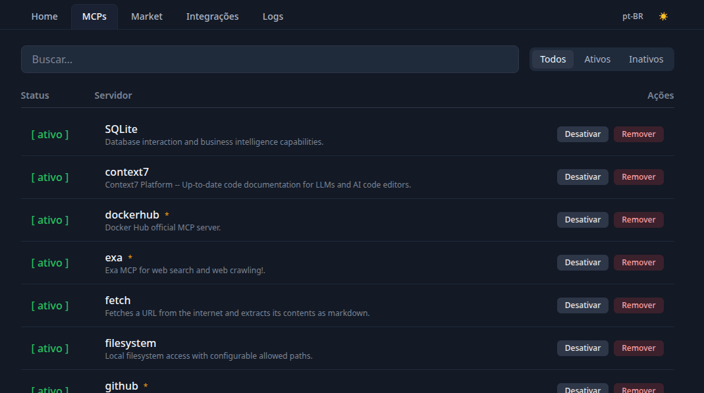
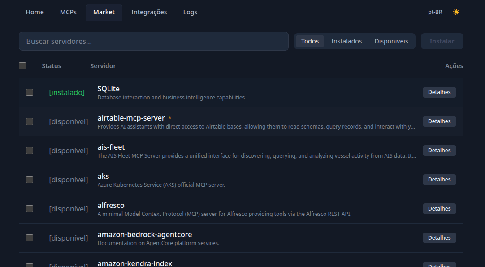
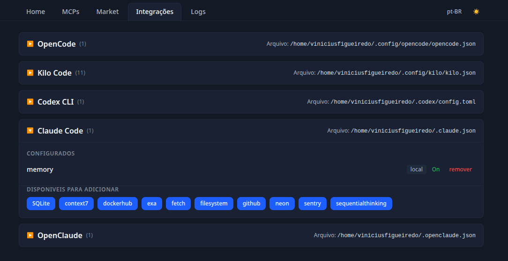
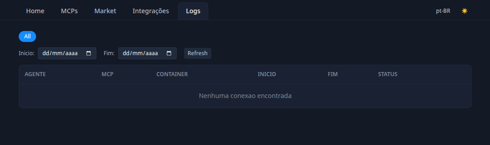

# gmcp — Gateway MCP Manager

Gerencia servidores MCP (Model Context Protocol) do Docker MCP Gateway com duas interfaces: **TUI curses** e **Web Vue 3**.

## Visão Geral

O Docker MCP Gateway expõe servidores MCP via SSE em `http://localhost:3099/sse`. O gmcp gerencia o ciclo de vida desses servidores — instala, ativa/desativa, remove, **compartilha entre agentes** — sincronizando com o profile Docker subjacente.

```
┌─────────────────────────────────────────────────────┐
│                  gmcp                                │
│  ┌─────────┐  ┌──────────┐  ┌────────────┐          │
│  │ TUI     │  │ Web UI   │  │ API REST   │          │
│  │(curses) │  │ (Vue 3)  │  │(FastAPI)   │          │
│  └────┬────┘  └────┬─────┘  └─────┬──────┘          │
│       └────────────┼──────────────┘                  │
│                    ▼                                 │
│           ┌────────────────┐                         │
│           │ GatewayService │ (hexagonal)             │
│           └───┬────┬────┬──┘                         │
│  ┌────────┐ ┌──┴──┐ ┌──┴──┐ ┌───────────┐ ┌──────┐ │
│  │ SQLite │ │File │ │Docker│ │Subprocess │ │ MCP  │ │
│  │Catalog │ │State│ │Profile││Gateway    │ │Relay │ │
│  └────┬───┘ └─────┘ └──┬───┘ └─────┬─────┘ └──┬───┘ │
│       ▼                ▼           ▼          ▼      │
│  mcp-toolkit.db   state.json   docker CLI   SSE :31xx│
└─────────────────────────────────────────────────────┘
```

## Interfaces

| Interface | Caminho | Tecnologia |
|-----------|---------|------------|
| **TUI** | `gmcp` (CLI) | Python curses |
| **Web** | `http://localhost:8173` | Vue 3 + Vite + Tailwind |
| **API** | `http://localhost:8000/api` | FastAPI + Uvicorn |

## Funcionalidades

- **Home**: Estatísticas do gateway, recursos do sistema (RAM/CPU/storage/online), logs recentes, restart
- **MCPs**: Servidores instalados com filtro All/Active/Inactive, busca, toggle, remoção, **compartilhamento (Share)**
- **Market**: Catálogo de servidores disponíveis, seleção múltipla para instalação, modal de detalhes, busca
- **Integrações**: Detecta agentes (OpenCode, Kilo Code, Claude Code, Codex CLI, OpenClaude) com **dropdown expansível**, adiciona MCPs automaticamente, modal com catálogo
- **Logs/Conexões**: Tabela de conexões de containers MCP com filtros tag/date/stop, **persistência SQLite**, **Clear em massa** com filtros MCP/período/últimos N min
- **Modo Compartilhado (Shared)**: Ativa relay SSE dedicado para um MCP — 1 container, N agentes simultâneos. Porta dedicada (3100+), configurável via TUI e Web
- **i18n**: pt-BR e en-US (detecção automática via `LANG`/`navigator.language`, seletor manual)
- **Dark/Light**: Tema alternável na navbar Web UI
- **Confirmação**: Diálogos antes de ações destrutivas
- **Autostart**: `gmcps` e `gmcps-web` iniciam o gateway automaticamente com watchdog

## Preview

| Home | MCPs | Market |
|------|------|--------|
|  |  |  |

| Integrações | Logs | 
|-------------|------|
|  |  |

## Suporte a Plataformas

| SO | TUI | Web | API | Observação |
|----|-----|-----|-----|------------|
| 🐧 **Linux** | ✅ | ✅ | ✅ | Alvo principal |
| 🪟 **Windows (WSL2)** | ✅ | ✅ | ✅ | Necessita Docker Desktop com integração WSL2 |
| 🍎 **macOS** | ✅ | ✅ | ✅ | TUI funcional (curses nativo via Darwin) |
| 🪟 **Windows nativo** | ❌ | ✅ | ❌ | Sem suporte a `curses` e `/proc/` |

> O **Docker MCP Gateway** requer Docker Desktop com o plugin MCP instalado. No Windows, utilize **WSL2**.

## Quick Start

### Instalação via npm (recomendado)

```bash
npm install -g @figcodessolucoes/gmcps

gmcps           # TUI curses (inicia gateway automaticamente)
gmcps-web       # Servidor web (inicia gateway automaticamente)
```

### Desenvolvimento (repositório clonado)

```bash
npm run dev:backend            # Apenas API (:8000)
npm run dev                    # Apenas frontend (:5173)
npm run dev:all                # Gateway + Backend + Frontend
```

### Docker

```bash
docker compose up -d
# Acessar: http://localhost:8173
```

## Modo Compartilhado (Shared)

Cada MCP pode rodar em modo **compartilhado** — um único container atende todos os agentes conectados:

```
Sem compartilhar (padrão):
  OpenCode ──► gateway:3099/sse?server=memory ──► container #1
  KiloCode ──► gateway:3099/sse?server=memory ──► container #2

Com compartilhamento ativo:
  OpenCode ──┐
  KiloCode ──┼──► relay:3100/sse ──► container mcp/memory (ÚNICO)
  OpenClaude─┘
```

**Ativar**:
- **TUI**: Aba MCPs → tecla `[s]` no servidor → indicador `S:3100`
- **Web**: Aba MCPs → botão **Share** → verde com porta

## Stack

### Backend
- **Python 3.14+** — runtime
- **FastAPI + Uvicorn** — REST API
- **SQLite** — catálogo MCP (`mcp-toolkit.db`), histórico de conexões (`connections.db`)
- **Pytest** — testes unitários (27 testes)

### Frontend (Web)
- **Vue 3.5** — framework SPA
- **Vite 8** — bundler | **TypeScript 6** — tipagem
- **Pinia 3** — estado global | **Vue Router 5** — navegação
- **Tailwind CSS 4** — estilização | **vue-i18n 10** — i18n
- **Vitest 4** — testes | **Playwright** — e2e

### TUI
- **Python curses** — terminal UI (stdlib apenas)

### DevOps
- **Docker** — runtime + deploy containerizado
- **PM2** — gerenciamento de processo (produção)
- **concurrently** — dev server paralelo
- **Oxlint + ESLint** — linting | **Prettier** — formatação
- **Fallow** — codebase intelligence (health 92 A)
- **Snyk** — security scan (0 vulns)

## Arquitetura

**Hexagonal (Ports & Adapters)** — todo o core está em `backend/core/` com interfaces abstratas em `ports.py`, implementações concretas em `adapters/`, e o `GatewayService` orquestrando a lógica de negócio.

```
backend/
├── core/
│   ├── entities.py      # Dataclasses de domínio
│   ├── ports.py         # Interfaces abstratas
│   ├── services.py      # Lógica de negócio
│   ├── i18n.py          # Internacionalização
│   └── integrations.py  # Detecção de agentes
├── adapters/
│   ├── sqlite_catalog.py     # Leitura do catálogo Docker
│   ├── file_state.py         # Persistência em state.json
│   ├── docker_profile.py     # Sincronia profile + gateway
│   ├── docker_containers.py  # Leitura de containers MCP
│   ├── connection_db.py      # Histórico SQLite de conexões
│   └── mcp_relay.py          # Relay compartilhado (SSE proxy)
├── main.py              # FastAPI
└── tests/
    ├── test_core.py
    └── test_api.py
```

## Estado

`~/.config/gmcp/state.json` gerencia servidores + modo compartilhado:

```json
{
  "installed": ["exa", "memory", "playwright"],
  "enabled": ["memory", "playwright"],
  "shared_servers": { "memory": 3100 }
}
```

## Comandos Úteis

```bash
# Iniciar
gmcps                 # TUI + gateway
gmcps-web             # Web + gateway
docker compose up -d  # Docker

# Gateway manual
./start-gateway.sh

# API
curl localhost:8000/api/stats
curl localhost:8000/api/resources

# Compartilhar
curl -X POST localhost:8000/api/servers/memory/share
curl -X POST localhost:8000/api/servers/memory/unshare

# PM2 (produção)
pm2 start gmcps-web --name gmcps-web
pm2 logs gmcps-web

# Testes
npx vitest run                      # Frontend
.venv/bin/python3 -m pytest backend/tests/  # Backend

# Qualidade
npm run fallow          # Full analysis
npm run snyk:test       # Security
npm run lint            # Lint
```

## Portas

| Serviço | Porta |
|---------|-------|
| Gateway MCP | 3099 |
| Backend API | 8000 |
| Frontend (Web) | 8173 |
| Shared relays | 3100+ |

## Variáveis Críticas

| Variável | Padrão | Descrição |
|----------|--------|-----------|
| `MCP_GATEWAY_AUTH_TOKEN` | `mcp-local-token` | Token de autenticação do gateway |
| `LANG` | `pt_BR.UTF-8` | Idioma da TUI |

## Licença

MIT
